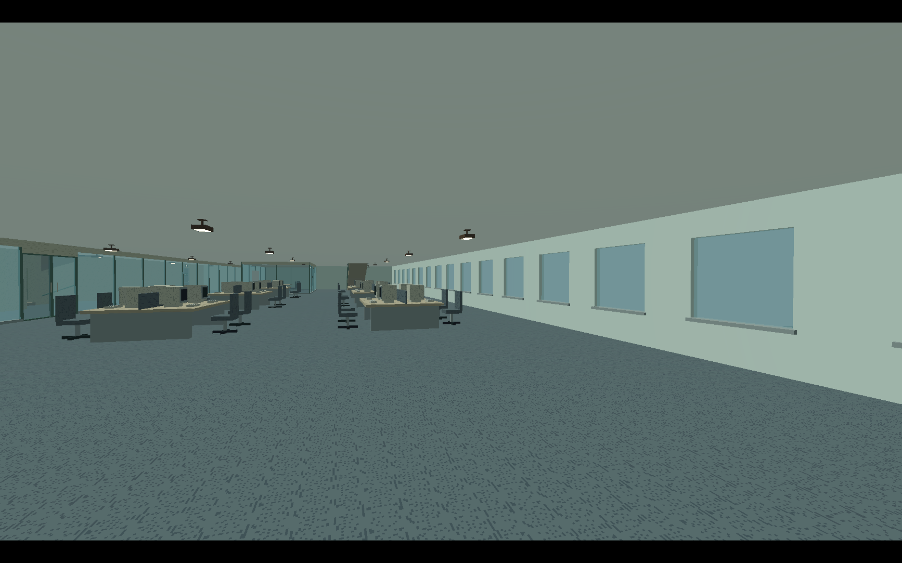
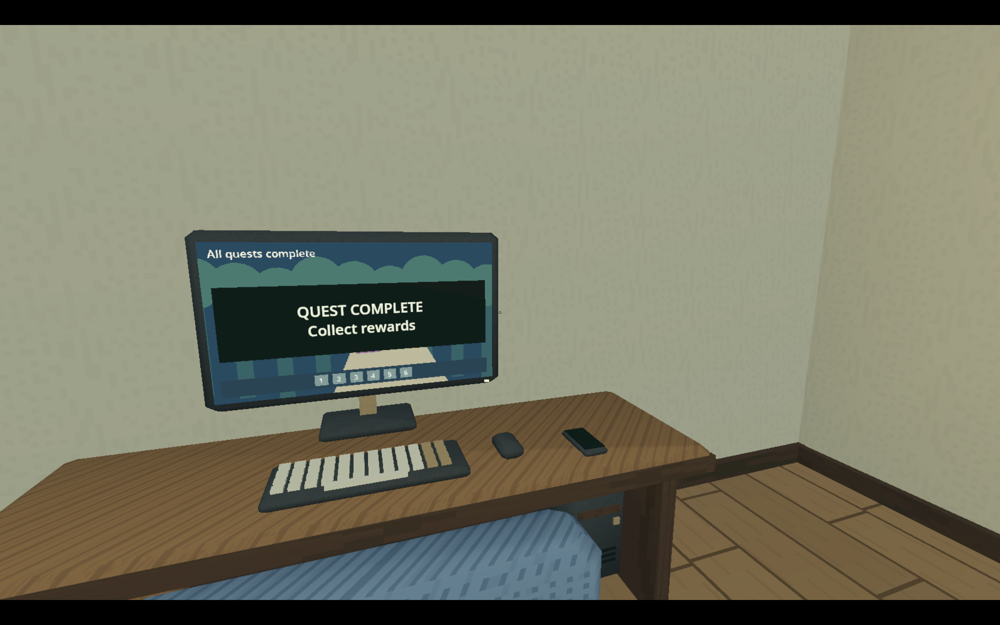
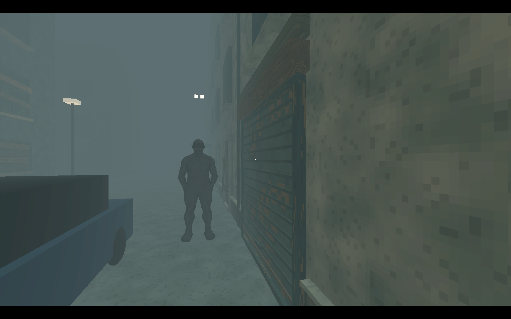

# Bundled visual examples

These PNGs are copied native development captures from Kuroverse: Torment, dated 5 October 2026. They are illustrative examples from the user's existing project. The skill contains the actual image files and does not need the game's source, models or original capture location.

Inspect the image relevant to the task. Transfer the visual principles selectively; a future game's genre, colors, props, layouts and character designs should follow its own brief. A static image supplies appearance evidence only, not performance or traversal verification.

## Repeated interior forms

Useful qualities: consistent furniture scale; readable desk/chair silhouettes; a restrained material family; exposed pixel texture detail; low surface gloss. In a different setting, change the palette and density while retaining coherent relationships. Flat lighting should still provide the contrast needed by that game.

## Everyday props at interaction distance

Useful qualities: simple keyboard/mouse/monitor forms; broad painted wood detail; a legible diegetic display; prop scale related to the room. The text and screen design belong to the example game and should not be copied into unrelated content.

## Fog, silhouettes and nearby shelter

Useful qualities: near objects establish scale; fog separates distance layers; broad car/building forms remain readable; a character is identifiable by silhouette. This image does not prove an appropriate enemy distance or stealth layout for another game. Choose those from its movement, reactions and encounter design, then connect fog to an explicit distance-rendering policy.
